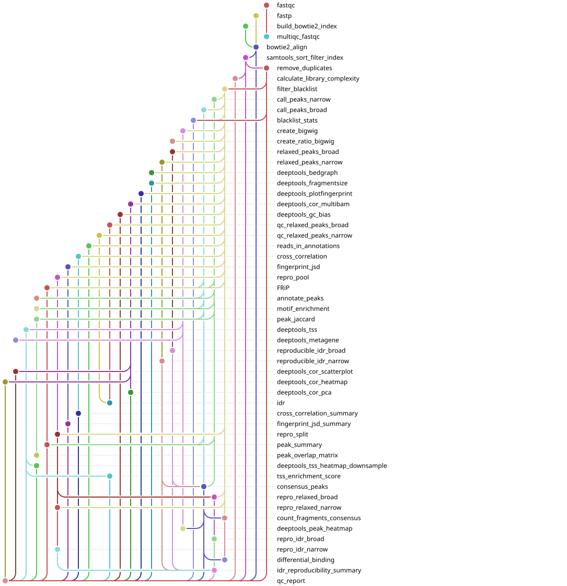

[](https://github.com/gynecoloji/snakemake_ChIPseq/actions/workflows/ci.yml)

# ChIP-seq Analysis Pipeline

A comprehensive Snakemake workflow for processing and analyzing paired-end
ChIP-seq data from raw reads to peak calling against a matched input/IgG control,
with per-sample **narrow or broad** peak mode, reproducible consensus peaks, and an
extensive quality-control stage.

This workflow mirrors the structure of
[`snakemake_ATACseq_spikein`](https://github.com/gynecoloji/snakemake_ATACseq_spikein)
adapted for ChIP-seq: **no spike-in**, MACS2 peak calling **with an input control**,
and per-sample broad/narrow selection.

## Overview

This pipeline integrates three complementary stages:

1. **Primary ChIP-seq stage** (`chipseq_all` target) — Raw FASTQ → human Bowtie2
   alignment → filtering → MACS2 peak calling **against a matched input/IgG
   control** (per-sample narrow or broad) → RPGC and **IP-over-input (log2) bigWig**
   tracks → a reproducible, fixed-width **consensus peak set** with a fragment-count
   matrix.
2. **QC stage** (`qc_all` target) — deepTools QC, FRiP, IDR, library complexity,
   TSS signal, reads-in-annotation, **ENCODE metrics** (NSC/RSC, fingerprint JSD,
   reproducibility ratios), a self-contained **interactive HTML QC report**
   (all QC except FastQC), plus a FastQC-only MultiQC.
3. **Downstream stage** (`downstream_all` target) — **peak annotation + GO**
   (ChIPseeker/clusterProfiler), **motif enrichment** (HOMER), **differential
   binding** (DESeq2 over the consensus matrix), **peak-set overlap** (Jaccard),
   and **signal heatmaps / metagene** profiles (deepTools).

All three stages live in a single standard-layout `workflow/Snakefile`: one
`snakemake --use-conda` run builds them in dependency order (unified DAG). Run a
subset with the `chipseq_all`, `qc_all`, or `downstream_all` targets. The layout
follows the
[Snakemake Workflow Catalog](https://snakemake.github.io/snakemake-workflow-catalog/)
conventions, so the workflow can be deployed into another project with
`snakedeploy deploy-workflow`.

## Workflow Diagram

The workflow rule graph, rendered as a "tube map" with
[snakevision](https://github.com/OpenOmics/snakevision):



The same tube map is rendered on the
[Snakemake Workflow Catalog page](https://snakemake.github.io/snakemake-workflow-catalog/)
from the executable test case in [`.test/`](.test). Regenerate it with:

```bash
snakemake -s workflow/Snakefile -c 1 -d .test --forceall --rulegraph > rulegraph.dot
snakevision --skip-rules all chipseq_all qc_all downstream_all -o images/rulegraph.svg rulegraph.dot
```

## Choosing peak mode and control (per sample + run-wide)

What this workflow lets you choose lives in `config/samples.csv` and `config.yaml`:

- **`peak_mode`** (per sample) — `narrow` (MACS2 default; TFs, sharp marks like
  H3K4me3), `broad` (`--broad`; H3K27me3, H3K9me3, H3K36me3), or **empty** for a
  **control-only** sample (Input/IgG) that is aligned and turned into a bigWig but
  never peak-called.
- **`input_control`** / **`igg_control`** (per sample) — the `sample_id` of the
  matched **Input** and **IgG** controls for that IP (either may be empty).
- **`control_type`** (run-wide, in `config.yaml`) — **`input` by default**, or
  `igg`: chooses which of the two controls MACS2 uses as `-c`. If the chosen column
  is empty for a sample it falls back to the other; if both are empty, that IP is
  called treatment-only. Override per run without editing the file with
  `--config control_type=igg`.

So you keep both controls in the sheet and flip `control_type` to compare
IgG- vs. Input-based calls. See [`config/README.md`](config/README.md) for the full
sample-sheet reference.

## Features

- **Complete end-to-end processing** of paired-end ChIP-seq data
- **MACS2 peak calling with a matched control**, choosing **Input (default) or
  IgG** run-wide (`control_type`), per-sample **narrow or broad** mode
- **IP-over-input `log2` ratio bigWig** tracks (deepTools `bamCompare`) plus RPGC
  depth-normalized tracks
- **Chromosome control**: align to a configurable set (default chr1–22, chrX, chrM),
  record mitochondrial-% QC, then keep only the analysis chromosomes
- **Reproducible consensus peaks** (Corces-2018 fixed-width / score-per-million;
  majority-vote or IDR reproducibility; narrow **and** broad) + a **featureCounts**
  fragment matrix for differential analysis
- **Blacklist region filtering** for removal of technical artifacts
- **Extensive QC metrics** including **ENCODE standards**: strand cross-correlation
  (NSC/RSC), fingerprint Jensen-Shannon distance, self-consistency/rescue
  reproducibility ratios, per-mode usable-read targets — plus fragment size,
  correlation/PCA, GC bias, TSS signal + numeric score, FRiP, NRF/PBC1/PBC2, and
  reads in promoters/enhancers
- **Interactive HTML QC report** (self-contained, theme-aware; all QC except
  FastQC) + a FastQC-only MultiQC
- **Signal track generation** (bigWig, bedGraph) for visualization
- **Conda environment management** (one env per rule) plus a ready-to-run
  **Docker / Apptainer** image

## Pipeline Components

### 1. Primary Processing Pipeline (`chipseq_all` target)

**Processing Steps:**
```
Raw FASTQ → FastQC → fastp
  → build human Bowtie2 index
  → Bowtie2 alignment
     → unique + properly-paired filter → mito-% QC → keep chr1–22/chrX
     → Picard dedup → blacklist filter
     → MACS2 peaks (narrow/broad) vs. the matched input/IgG control
     → RPGC + IP-over-input (log2) bigWigs
     → consensus peaks → featureCounts fragment matrix
```

**Key Features:**
- Quality assessment with FastQC; read trimming/filtering with fastp
- Bowtie2 alignment to the human genome; uniquely-mapped, properly-paired
  filtering; filtering-orphaned mates removed; **mitochondrial-% recorded** then
  non-primary chromosomes dropped
- Picard duplicate removal + fragment-level ENCODE blacklist filtering
- **MACS2 peak calling (BAMPE)** with `-c <input_control>` when set;
  `--broad --broad-cutoff` for broad samples
- **Consensus peaks** (fixed-width, SPM-ranked; majority-vote/IDR reproducibility;
  narrow and broad) + **featureCounts** matrix

### 2. Quality Control Pipeline (`qc_all` target)

**Comprehensive QC Metrics** (run after the primary pipeline; consumes its `results/`):
- **Fingerprint** - Signal-to-noise (the canonical ChIP-seq IP-vs-input QC)
- **Strand cross-correlation (ENCODE)** - **NSC / RSC**, estimated fragment length and
  QualityTag via phantompeakqualtools (targets NSC ≥ 1.05, RSC ≥ 0.8)
- **Fingerprint JSD (ENCODE)** - deepTools IP-vs-control **Jensen-Shannon distance**,
  % genome enriched, AUC
- **IDR reproducibility (ENCODE)** - **self-consistency + rescue ratios** (Nt/Np/N1/N2)
  from self- and pooled-pseudoreplicate IDR, with the "both < 2" verdict
- **Fragment Size Analysis** - Insert-size distribution
- **TSS Signal** - Heatmap/profile **and a numeric per-sample score**
- **Sample Correlation** - Multi-sample correlation heatmap/scatter and PCA
- **GC Bias Assessment** - Sequence composition bias evaluation
- **FRiP Scores** - Fraction of Reads in Peaks (per IP sample)
- **Library Complexity** - PCR bottlenecking assessment (NRF, PBC1, PBC2)
- **Usable read depth** - ENCODE per-mode targets (narrow ≥ 20M, broad ≥ 45M)
- **IDR Analysis** - Irreproducible Discovery Rate on relaxed peak calls, per pair
- **Peak + annotation summary** - Peak counts/widths and reads in promoters vs
  enhancers
- **Interactive HTML QC report** (`chipseq_qc_report.html`) - one self-contained,
  theme-aware page for all QC **except FastQC**, with ENCODE-style pass/warn/fail
  flags; numeric metrics render as interactive tables/bar charts and the deepTools
  QC renders as **interactive SVG/canvas charts drawn client-side**
- **FastQC MultiQC report** (`multiqc_fastqc.html`) - MultiQC scoped to FastQC only

### 3. Downstream Analysis Pipeline (`downstream_all` target)

Biological interpretation on top of the peaks, consensus set, count matrix and
bigWigs:
- **Peak annotation + GO** (ChIPseeker + clusterProfiler) - per IP sample: nearest
  gene/TSS, genomic-feature distribution, distance-to-TSS, and GO (BP) enrichment
  on target genes → `results/annotation/<sample>/`
- **Motif enrichment** (HOMER `findMotifsGenome.pl`) - known + de novo motifs under
  each IP sample's peaks (size 200 for narrow, full region for broad) →
  `results/motifs/<sample>/`
- **Differential binding** (DESeq2) - per configured contrast over the consensus
  count matrix: results table, significant gained/lost peaks (ChIPseeker-annotated),
  MA/volcano/PCA plots → `results/diff_binding/<contrast>/`
- **Peak-set overlap** - pairwise bedtools **Jaccard** matrix + heatmap across IP
  samples → `results/peak_overlap/`
- **Signal heatmaps / metagene** (deepTools) - peak-centered heatmap over the
  consensus set and a gene-body scale-regions metagene → `results/deeptools/`

Differential-binding contrasts are set in `config.yaml` (`contrasts:`); leave the
list empty to skip that step. A contrast runs **only if both conditions have ≥2
replicates** — single-replicate (1-vs-1) contrasts are skipped automatically
(DESeq2 needs replicates), so the shipped 1-replicate example runs no DB.

## Requirements

- [Snakemake](https://snakemake.readthedocs.io/) ≥8.0.0
- [Conda](https://docs.conda.io/en/latest/) / [Mamba](https://github.com/mamba-org/mamba) (recommended)
- [Python](https://www.python.org/) ≥3.8
- UNIX-based system (Linux/MacOS)

### Software Dependencies
(automatically installed via conda environments):
- **FastQC** (quality control)
- **fastp** (read trimming)
- **Bowtie2** (alignment to the human genome)
- **SAMtools** (BAM processing, idxstats)
- **Picard** (duplicate removal)
- **MACS2** (peak calling with input control; narrow/broad)
- **deepTools** (bigWig/bedGraph, QC and visualization; `bamCompare` ratio tracks; fingerprint JSD)
- **bedtools** + **bc** (genomic interval operations; FRiP / complexity / annotation)
- **IDR** (reproducibility analysis)
- **phantompeakqualtools** (SPP) (ENCODE strand cross-correlation: NSC / RSC)
- **featureCounts / Subread** (fragment quantification over the consensus set)
- **ChIPseeker / clusterProfiler** + **DESeq2** (R/Bioconductor) (peak annotation, GO, differential binding)
- **HOMER** (motif enrichment)

### Reference Files (`ref/`)

Files fall into three groups: **shipped** with the repo (present after clone),
**downloaded** from public sources, and **generated** locally from the downloads.

```
ref/
├── config.yaml                          # (shipped in config/)
│  ── downloaded (public sources; not in the repo) ──
├── hg38.fa                              # human genome FASTA (UCSC, chr-prefixed)
├── hg38.2bit                            # human genome 2bit (QC: GC bias)
├── gencode.v36.annotation.gtf           # GENCODE annotation (TSS)
├── picard.jar                           # Picard (MarkDuplicates)
│  ── shipped ──
├── hg38_blacklist_regions.bed           # ENCODE hg38 blacklist v2
├── promoter_chr1-22X.bed                # Ensembl Regulatory Build promoters (QC)
├── enhancer_chr1-22X.bed                # Ensembl Regulatory Build enhancers (QC)
├── Promoter_*_hg38_{3000,5000}bp_chr1-22X.bed  # TSS windows (unique / MANE / CAGE)
│  ── built by the pipeline ──
└── BOWTIE2/                             # human Bowtie2 index (build_bowtie2_index)
```

### Reference files: download & generate

```bash
cd ref

# Human genome + 2bit (UCSC goldenPath)
curl -O https://hgdownload.soe.ucsc.edu/goldenPath/hg38/bigZips/hg38.fa.gz && gunzip hg38.fa.gz
curl -O https://hgdownload.soe.ucsc.edu/goldenPath/hg38/bigZips/hg38.2bit

# GENCODE v36 gene annotation
curl -O http://ftp.ebi.ac.uk/pub/databases/gencode/Gencode_human/release_36/gencode.v36.annotation.gtf.gz
gunzip gencode.v36.annotation.gtf.gz

# Picard (MarkDuplicates)
curl -L -o picard.jar https://github.com/broadinstitute/picard/releases/latest/download/picard.jar

cd ..
samtools faidx ref/hg38.fa
```

The ENCODE blacklist ships with the repo; to refresh it (Boyle Lab v2):

```bash
curl -L https://github.com/Boyle-Lab/Blacklist/raw/master/lists/hg38-blacklist.v2.bed.gz \
  | gunzip > ref/hg38_blacklist_regions.bed
```

The human Bowtie2 index (`ref/BOWTIE2/`) is built automatically by the pipeline's
`build_bowtie2_index` rule from `hg38.fa` — no manual step.

## Installation

```bash
git clone https://github.com/gynecoloji/snakemake_ChIPseq.git
cd snakemake_ChIPseq

# You need Snakemake + conda/mamba as the driver. The per-rule tool environments
# (workflow/envs/*.yaml) are created automatically on the first `--use-conda` run.
mamba create -n chipseq -c conda-forge -c bioconda snakemake-minimal pandas
conda activate chipseq
```

> **No local install?** Use the container image instead — see
> [Container Execution](#container-execution-docker--apptainer).

## Configuration

All parameters live in `config/config.yaml`, which ships with working defaults and
an inline comment on each one. The [config schema](workflow/schemas/config.schema.yaml)
is the **single source of truth** for parameter types, defaults, and descriptions:
the workflow validates your config against it on every run. See
[`config/README.md`](config/README.md) for the sample sheet and reference-data
details.

At minimum, point the reference-file paths at the genomes/annotation you provide:

```yaml
samples_table: "config/samples.csv"                # sample sheet
human_fasta:   "ref/hg38.fa"                       # chr-prefixed UCSC hg38 (you provide)
gtf:           "ref/gencode.v36.annotation.gtf"    # GENCODE, chr-prefixed (TSS QC)
```

## Data Preparation

### Input Files
Please pay attention to the **common suffix** of the fastq files (`_R1/2_001.fastq.gz`).
Accepted file format: **sample_id** + **common suffix**
(e.g. `GSF2801-ChIPseq-OVCAR3-Control-IP-cJun_S1_R1_001.fastq.gz`).

Place paired-end FASTQ files in the `data/` directory:
```
data/{sample}_R1_001.fastq.gz
data/{sample}_R2_001.fastq.gz
```

### Sample Information

Create `config/samples.csv` (columns `sample_id, condition, replicate,
input_control, igg_control, peak_mode, notes`):

```csv
sample_id,condition,replicate,input_control,igg_control,peak_mode,notes
GSF2801-ChIPseq-OVCAR3-Control-Input_S3,Input,1,,,,Control input (control-only)
GSF2801-ChIPseq-OVCAR3-Control-IP-cJun_S1,Ctrl_cJUN,1,GSF2801-ChIPseq-OVCAR3-Control-Input_S3,GSF2801-ChIPseq-OVCAR3-Control-IP-IgG_S2,narrow,Control cJUN
GSF2801-ChIPseq-OVCAR3-Control-IP-IgG_S2,Ctrl_IgG,1,GSF2801-ChIPseq-OVCAR3-Control-Input_S3,,narrow,Control IgG
GSF2801-ChIPseq-OVCAR3-3D-Input_S6,Input,1,,,,3D input (control-only)
GSF2801-ChIPseq-OVCAR3-3D-IP-cJun_S4,3D_cJUN,1,GSF2801-ChIPseq-OVCAR3-3D-Input_S6,GSF2801-ChIPseq-OVCAR3-3D-IP-IgG_S5,narrow,3D cJUN
GSF2801-ChIPseq-OVCAR3-3D-IP-IgG_S5,3D_IgG,1,GSF2801-ChIPseq-OVCAR3-3D-Input_S6,,narrow,3D IgG
```

The `condition` column defines replicate groups (all IP rows sharing a condition
are replicates). It drives **consensus-peak reproducibility** (majority vote for
≥3-replicate conditions, IDR for 2-replicate conditions) and pairwise IDR in QC.
`control_type` in `config.yaml` (default `input`) selects whether MACS2 uses each
IP's `input_control` or `igg_control`.

## Running the Pipeline

A single run builds the primary stage **and** the QC report in dependency order
(unified DAG); use the `chipseq_all` / `qc_all` targets to run just one stage.

### Dry Run

```bash
snakemake -s workflow/Snakefile -n                   # whole workflow (primary → QC)
snakemake -s workflow/Snakefile -n chipseq_all       # primary only
snakemake -s workflow/Snakefile -n qc_all            # QC only
```

### Local Execution

```bash
snakemake -s workflow/Snakefile --use-conda --cores 20                 # everything
snakemake -s workflow/Snakefile --use-conda --cores 20 chipseq_all     # primary only
snakemake -s workflow/Snakefile --use-conda --cores 20 qc_all          # QC only
snakemake -s workflow/Snakefile --use-conda --cores 20 downstream_all  # annotation/motifs/DB/overlap
```

### Container Execution (Docker / Apptainer)

The image ships Snakemake + all eight per-rule conda envs; you install nothing
except Docker or Apptainer. Genomes/FASTQs are **not** baked in — you mount your
project directory at run time. See [`DOCKER.md`](DOCKER.md) for the full guide.

```bash
# Build once (pre-bakes the conda envs)
docker build -t chipseq:latest .        # or: docker compose build

# Run from your project directory (holds workflow/, config/, ref/, data/):
docker run --rm -v "$(pwd)":/workflow -e HOME=/tmp --user "$(id -u):$(id -g)" \
    chipseq:latest -s workflow/Snakefile --cores 16

# Convenience wrappers:
./run_pipeline.sh --cores 16                 # everything (primary → QC)
docker compose run --rm chipseq --cores 16 qc_all
```

On HPC without Docker, convert the image to a SIF once and run with Apptainer
(see [`DOCKER.md`](DOCKER.md)).

## Deploying with snakedeploy

This repository follows the Snakemake Workflow Catalog structure, so it can be
deployed into another project without cloning it by hand:

```bash
pip install snakedeploy
snakedeploy deploy-workflow https://github.com/gynecoloji/snakemake_ChIPseq . --tag main
```

## Pipeline Details

### 1. Quality Control and Preprocessing
- **FastQC** - Quality assessment of raw reads
- **Fastp** - Adapter trimming (auto-detects PE adapters; override with
  `adapter_r1`/`adapter_r2`), poly-G trimming, sliding-window quality (window 4,
  mean Q20), minimum length 30bp

### 2. Alignment and Filtering
- **`build_bowtie2_index`** - human genome index (optionally subset to `align_chroms`)
- **Bowtie2** - `-X 3000 -I 0 --no-discordant --no-mixed`
- **Filtering** - properly-paired (`-f 2 -F 2316`), uniquely-mapped (`grep -v XS:i:`),
  filtering-orphaned mates removed; **mito-% recorded** (`idxstats`), then restricted
  to `keep_chroms`

### 3. Post-processing
- **Picard MarkDuplicates** (`REMOVE_DUPLICATES=true`)
- **Fragment-level blacklist filtering** (bedtools, proper paired-end handling)

### 4. Peak Calling
- **MACS2** (BAMPE, `-q`), with `-c <control>` when the sample has a resolved
  control (Input or IgG, per `control_type`; default Input). `narrow` samples call
  standard peaks; `broad` samples add `--broad --broad-cutoff`. Control-only samples
  (empty `peak_mode`) are not peak-called.

### 5. Signal Tracks and Consensus Peaks
- **`create_bigwig`** - RPGC depth-normalized bigWigs (all samples)
- **`create_ratio_bigwig`** - `bamCompare -b1 IP -b2 input --operation log2`
  (read-count scaled) for IP samples with a matched control
- **Consensus peaks** - Corces-2018 fixed-width (`consensus_window`), SPM
  iterative-overlap peaks; per-condition majority vote (≥3 reps) or IDR (2 reps);
  narrowPeak uses the summit column, broadPeak uses the interval midpoint;
  blacklist / chrM / chrY / non-primary excluded
- **Fragment counting** - `featureCounts` (paired-end) over the consensus set →
  `results/consensus/consensus_counts.txt` (a regions × samples matrix)

### 6. Comprehensive QC Metrics (`qc_all` target)
- Fingerprint, fragment size, correlation/PCA, GC bias, TSS signal + numeric score,
  FRiP, NRF/PBC1/PBC2, reads in promoters/enhancers, IDR
- **ENCODE metrics** - strand cross-correlation (NSC/RSC + fragment length,
  phantompeakqualtools), fingerprint Jensen-Shannon distance (deepTools), and
  self-consistency + rescue reproducibility ratios (self/pooled-pseudoreplicate IDR)
- **Interactive QC report** - `chipseq_qc_report.html` (self-contained; all QC
  except FastQC) plus `multiqc_fastqc.html` (FastQC only)

## Output Files

```
results/
├── fastqc/                 # FastQC reports
├── fastp/                  # Trimmed reads and reports
├── aligned/                # Bowtie2 log ({sample}.bowtie2.log) + BAM
├── filtered/               # Filtered BAM + {sample}.idxstats.txt (mito QC) + summaries
├── dedup/                  # Deduplicated BAM + Picard metrics
├── blacklist_filtered/     # Analysis-ready BAM ({sample}.nobl.bam)
├── peaks/                  # MACS2 peak calls (*_peaks.narrowPeak / *_peaks.broadPeak)
├── bigwig/                 # RPGC-normalized bigWigs ({sample}.bw)
├── ratio_bigwig/           # IP-over-input log2 bigWigs ({sample}.log2ratio.bw)
├── consensus/
│   ├── consensus_peaks.bed # Fixed-width, non-overlapping consensus set
│   ├── consensus_peaks.saf # featureCounts input
│   └── consensus_counts.txt # Fragment count matrix (regions × samples)
├── peaks_relaxed/, qc_relaxed_peaks/  # Relaxed MACS2 calls (IDR input)
├── deeptools/              # Fragment size, fingerprint, correlation/PCA, GC bias,
│                           #   TSS matrix/plots + downsampled-heatmap JSON
├── bedgraph/               # RPGC bedGraphs (QC)
├── FRiP/                   # FRiP scores (*.frip.txt)
├── library_complexity/     # NRF / PBC1 / PBC2 (*_complexity.txt)
├── idr/, idr_reproducibility/       # IDR peak calls + ENCODE reproducibility (self/pooled pseudo-reps)
├── qc_crosscorr/, qc_fingerprint/   # ENCODE NSC/RSC + fingerprint JSD
├── peak_annotation/        # Reads in promoters / enhancers (QC)
├── qc/
│   ├── chipseq_qc_report.html      # Interactive QC report (all QC except FastQC)
│   ├── multiqc_fastqc.html         # FastQC-only MultiQC
│   ├── tss_enrichment_scores.tsv, peak_summary.tsv, cross_correlation.tsv
│   ├── fingerprint_jsd.tsv, idr_reproducibility.tsv
│   └── blacklist_filtering_stats.txt
# ── Downstream analysis (downstream_all target) ──
├── annotation/             # ChIPseeker peak annotation + GO (per IP sample)
├── motifs/                 # HOMER motif enrichment (per IP sample)
├── diff_binding/           # DESeq2 differential binding (per contrast)
└── peak_overlap/           # Peak-set Jaccard matrix + heatmap
```

### Directory Structure
```
snakemake_ChIPseq/                     # Snakemake Workflow Catalog layout
├── config/
│   ├── config.yaml         # Workflow parameters
│   ├── samples.csv         # Sample sheet (sample_id, condition, replicate, input_control, peak_mode, notes)
│   └── README.md           # Configuration reference
├── workflow/
│   ├── Snakefile           # Entry point (unified DAG; targets: chipseq_all, qc_all)
│   ├── rules/              # common.smk, chipseq.smk, qc.smk
│   ├── scripts/            # Python scripts used by the rules
│   ├── schemas/            # config.schema.yaml
│   └── envs/               # Per-rule conda environment files
├── .snakemake-workflow-catalog.yml    # Catalog metadata
├── data/                   # Raw FASTQ files (you provide)
├── ref/                    # Reference genomes/annotations/BEDs (you download)
│   └── BOWTIE2/            # Human Bowtie2 index (built by the pipeline)
├── create_envs.smk         # Build-time helper (pre-bakes the conda envs into the image)
├── Dockerfile, docker-compose.yml, run_pipeline.sh, DOCKER.md
├── results/                # All pipeline outputs (detailed above)
└── logs/                   # Per-rule logs
```

## Troubleshooting

1. **Low alignment rate** — check reference genome version, adapter trimming, and
   FastQC reports.
2. **Weak fingerprint / low FRiP** — poor IP enrichment; check antibody, input
   control pairing, and library complexity (NRF/PBC1/PBC2).
3. **High duplication** — low library complexity; check PBC1/PBC2 and sequencing
   depth.
4. **Failed IDR** — low reproducibility between replicates; check sample
   consistency and peak-calling parameters.
5. **Broad vs. narrow** — set `peak_mode` to `broad` for spread marks (H3K27me3,
   H3K9me3, H3K36me3) and `narrow` for TFs and sharp marks (H3K4me3).

## Running the tests

```bash
python -m pytest tests/ -q                                             # unit tests
snakemake -s workflow/Snakefile -n --cores 1                           # dry run (DAG + config)
snakemake -s workflow/Snakefile -d .test -n --cores 1                  # dry run (broad + IDR case)
snakemake -s workflow/Snakefile -c 1 -d .test --forceall --rulegraph   # tube map (rule graph)
```

## Citation

If you use this workflow, cite it via the **"Cite this repository"** button on the
GitHub page (from [`CITATION.cff`](CITATION.cff)).

**Please also cite the individual tools used:**
- **Snakemake**: Köster, J. and Rahmann, S. (2012). Bioinformatics, 28(19), 2520-2522.
- **MACS2**: Zhang, Y. et al. (2008). Genome Biology, 9, R137.
- **deepTools**: Ramírez, F. et al. (2016). Nucleic Acids Research, 44(W1), W160-W165.
- **Bowtie2**: Langmead, B. and Salzberg, S.L. (2012). Nature Methods, 9, 357-359.
- **SAMtools**: Li, H. et al. (2009). Bioinformatics, 25(16), 2078-2079.
- **IDR**: Li, Q. et al. (2011). Annals of Applied Statistics, 5(3), 1752-1779.
- **phantompeakqualtools / SPP (NSC/RSC)**: Landt, S.G. et al. (2012). Genome Research, 22(9), 1813-1831; Kharchenko, P.V. et al. (2008). Nature Biotechnology, 26, 1351-1359.
- **ChIPseeker**: Yu, G. et al. (2015). Bioinformatics, 31(14), 2382-2383.
- **clusterProfiler**: Wu, T. et al. (2021). The Innovation, 2(3), 100141.
- **DESeq2**: Love, M.I. et al. (2014). Genome Biology, 15, 550.
- **HOMER**: Heinz, S. et al. (2010). Molecular Cell, 38(4), 576-589.
- **featureCounts (Subread)**: Liao, Y. et al. (2014). Bioinformatics, 30(7), 923-930.
- **Consensus peaks (fixed-width / SPM)**: Corces, M.R. et al. (2018). Science, 362(6413), eaav1898.
- **BEDTools**: Quinlan, A.R. and Hall, I.M. (2010). Bioinformatics, 26(6), 841-842.
- **FastQC**: Andrews, S. (2010).
- **fastp**: Chen, S. et al. (2018). Bioinformatics, 34(17), i884-i890.

## License

This project is licensed under the MIT License - see the [LICENSE](LICENSE) file.

---

**Note**: This pipeline is optimized for human genome analysis (hg38) but can be
adapted for other organisms by updating reference files and parameters. It was
adapted from the ENCODE-inspired `snakemake_ATACseq_spikein` workflow for ChIP-seq
(no spike-in; peak calling with an input control; per-sample broad/narrow mode).
